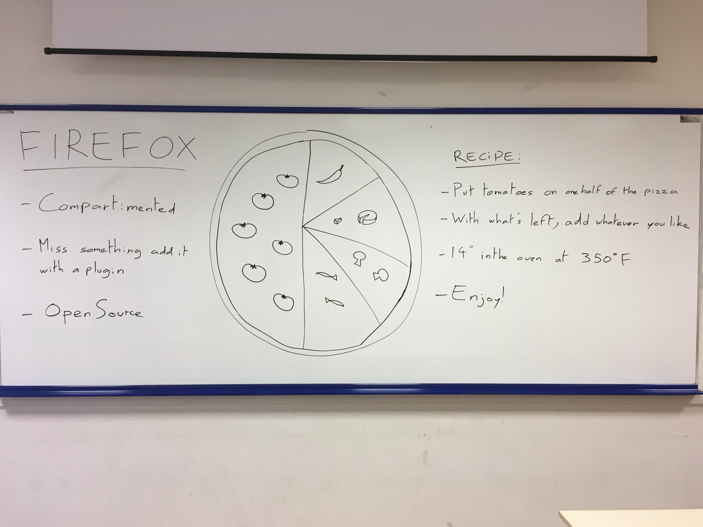
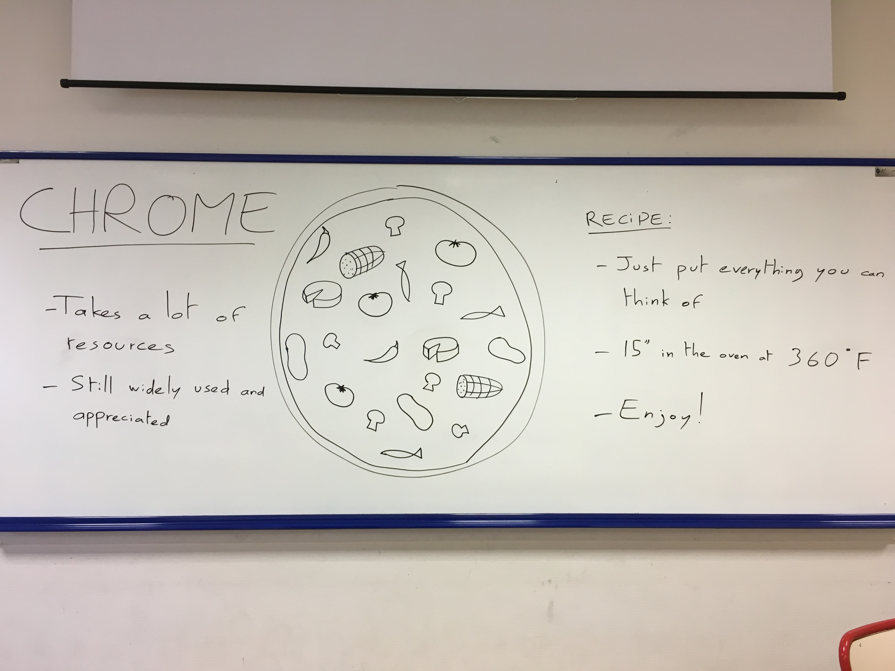
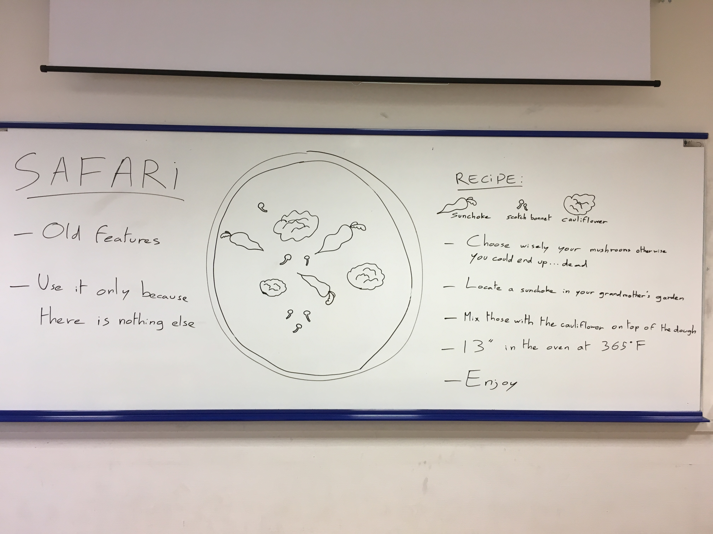
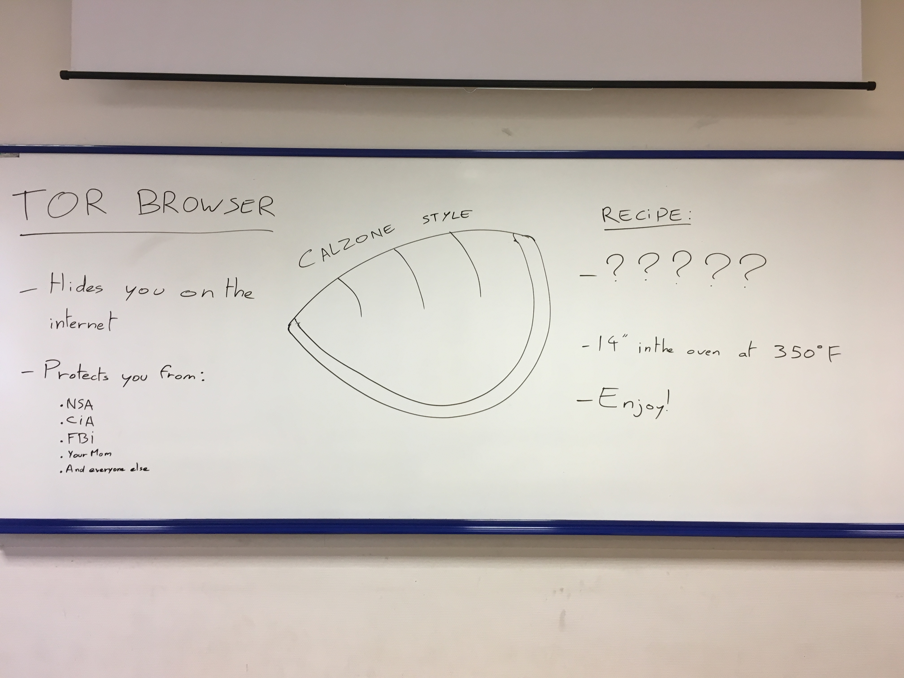

# Web browsers

In this part, you'll learn about web browsers. We guess that most of you know what is a social network but here's a explanation from a very know and serious web encyclopedia.

> A web browser (commonly referred to as a browser) is a software application for retrieving, presenting and traversing information resources on the World Wide Web.
> An information resource is identified by a Uniform Resource Identifier (URI/URL) that may be a web page, image, video or other piece of content.
> Hyperlinks present in resources enable users easily to navigate their browsers to related resources. (Source: Wikipedia)

Once again, we are gonna present only the biggest ones and a challenger:
* [Firefox](#firefox)
* [Chrome](#fhrome)
* [Safari](#safari)
* [Tor Browser](#tor-browser)

## Firefox

[Firefox](https://www.mozilla.org/en-US/firefox/new/) is the web browser developped by The ~~Mozzarella~~ Mozilla Fondation, a non-profit organization supporting the free and open-source Software. Firefox was best known for being the principal opponent to Internet Explorer in the battle of the browsers. More up-to-date, secure and open-source, it was long leading the race, and appealed to a large portion of the "tech people" as it allowed anyone to add and create extensions: small piece of software that enhanced the browser.

However, as Firefox was ahead under the clear sky, a new opponent entered the race...

## Chrome

As of today, [Google Chrome](https://www.google.com/chrome/) is at [a high standing 62% market share](http://gs.statcounter.com/browser-market-share/desktop/worldwide), leading ahead of Firefox and Internet Explorer, respectively 15 and 9%. In 2008, Google unveiled what was going to be their first offline product: a web browser that was gonna disrupt the market. Fast forward to our year, Chrome is starting to be known for an other of its particularities: its incredibly high need of computer ressources. Let's try that: Statistically speaking, there are 62% chances that you are currently using Google Chrome to read this. If that is so: open your Ressource Manager (CTRL+ALT+SUPPR on Windows or Spotlight > Activity Manager on MacOS) and watch how much of your CPU is used by Google Chrome. Frightening, right?

## Safari

Apple is known for developping software tailored for their products. [Safari](http://www.apple.com/lae/safari/) is their Web Browser and even if we are Apple fan boys, we CANNOT approve of this piece of software. Safari is years late for HTML5 and ES2016 compliance and security updates. Moreover, it does not have any original features compared to Firefox or Chrome. We just use it to install an other web browser.

## Tor Browser

Wikileaks, Snowden, NSA, etc.. We live in a world where [knowledge is power](https://www.youtube.com/watch?v=sKTc8Chvw5k) which also means that hiding your information is more valuable than ever. [Tor Browser](https://www.torproject.org/projects/torbrowser.html.en) let you achieve that. Base on Firefox, it does not compromise on your security and anonymity and uses the Tor Network, allowing you to browse websites with absolutely NO way to trace it back to you.

  
[< Previous (Social networks)](../SocialNetworks)[(Operating systems) Next >](../OperatingSystems)
