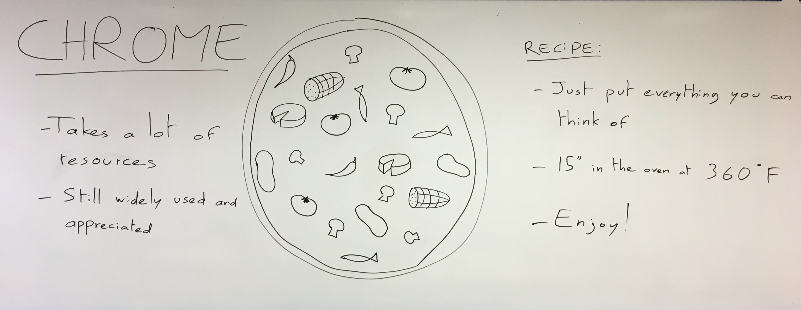
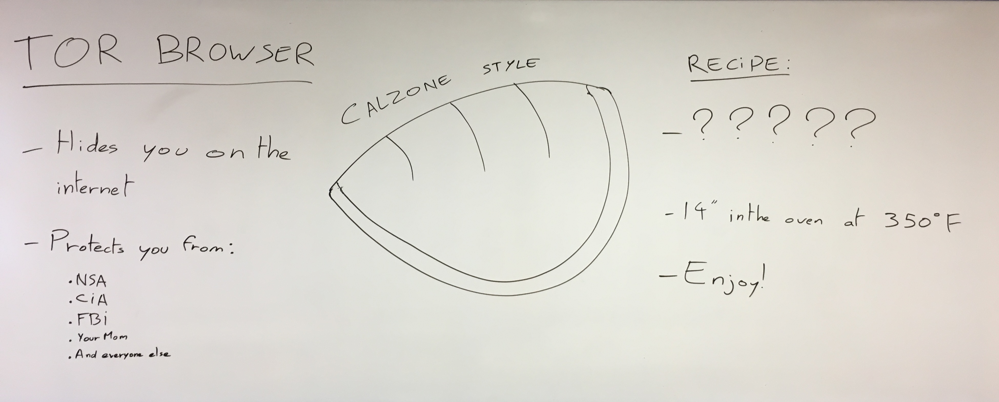

# Web browsers

In this part, you'll learn about web browsers. We guess that most of you know what is a social network but here's a explanation from a very know and serious web encyclopedia.

> A web browser (commonly referred to as a browser) is a software application for retrieving, presenting and traversing information resources on the World Wide Web.
> An information resource is identified by a Uniform Resource Identifier (URI/URL) that may be a web page, image, video or other piece of content.
> Hyperlinks present in resources enable users easily to navigate their browsers to related resources. (Source: Wikipedia)

Once again, we are gonna present only the biggest ones and a challenger:
* [Firefox](#firefox)
* [Chrome](#fhrome)
* [Safari](#safari)
* [Tor Browser](#tor-browser)

## Firefox

Firefox is the web browser developped by The ~~Mozzarella~~ Mozilla Fondation, a non-profit organization supporting the free and open-source Software. Firefox was best known for being the principal opponent to Internet Explorer in the battle of the browsers. More up-to-date, secure and open-source, it was long leading the race, and appealed to a large portion of the "tech people" as it allowed anyone to add and create extensions: small piece of software that enhanced the browser.

However, as Firefox was ahead under the clear sky, a new opponent entered the race...

## Chrome

## Safari

## Tor Browser

  
[< Previous (Social networks)](../SocialNetworks)[(Operating systems) Next >](../OperatingSystems)
